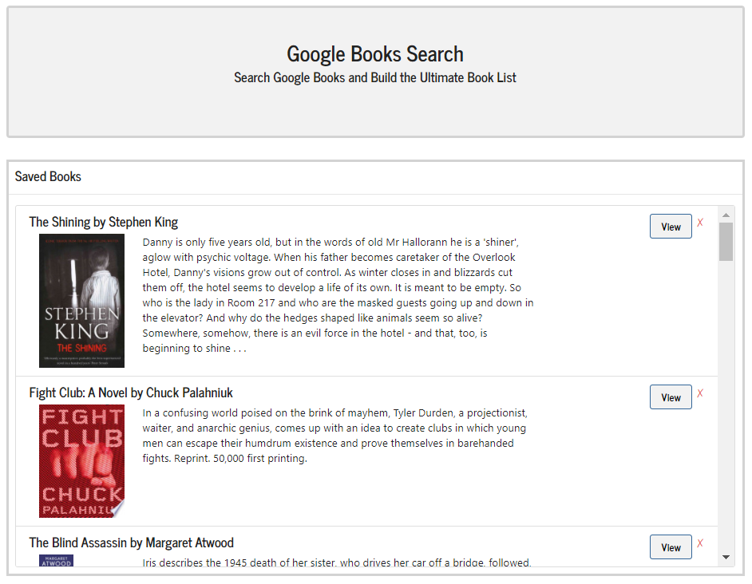
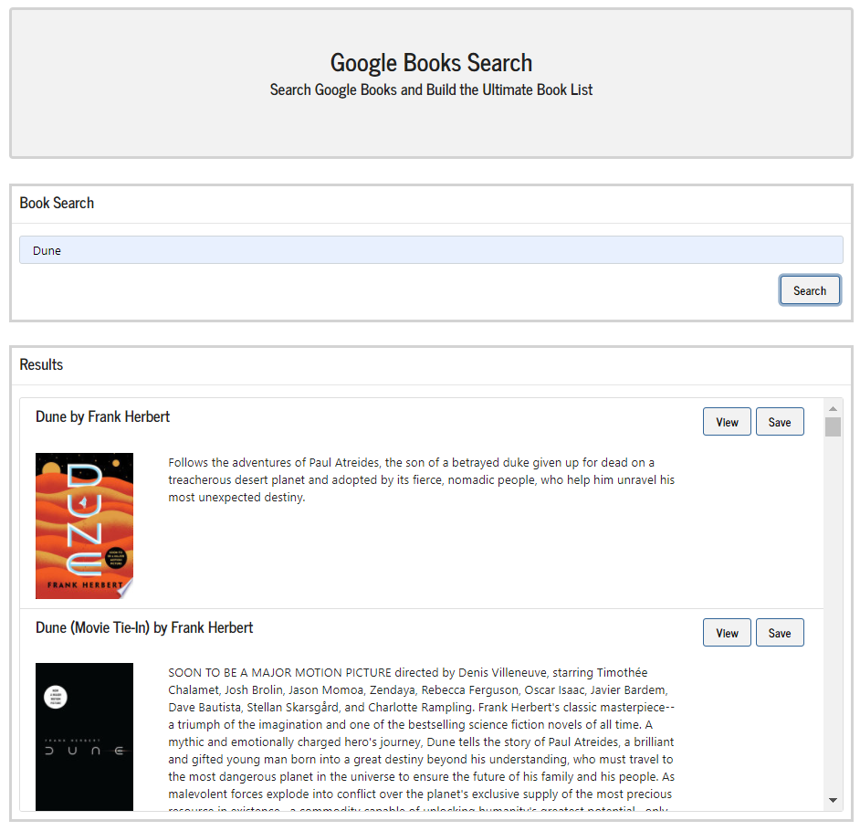

# Ultimate Book List
## 
## Description 
This application allows users to create book lists from book queries against the Google Books API. This allows users to create personal repositories of books stored in MongoDB/Atlas DB with links directly to those books in Google. Technology used in this project includes: Javascript, HTML, CSS/Bootstrap framework, RESTful Web API (Google Books API), mongoose deployed to MongoDB/Atlas, Heroku, MVC.
## Table of Contents
- [Installation](#installation)
- [Usage](#usage)
- [Screenshot](#screenshot)
- [License_Details](#license_details)
- [Contributing](#contributing) 
- [Tests](#tests)
- [Questions](#questions)
## Installation
To install the necessary dependencies run:

npm i

Run the deployed application from: https://ultimate-book-list.herokuapp.com/.
## Usage
Enter books or authors in the search field. Matching books will be returned from Google Books API. From the results list choose save to add to your Ultimate Book List or choose view to see the book details on Google Books. Choose the saved menu to see the books in the Ultimate Book List. From here choose view to see the book in Google Books or click the X to remove the book from the list and delete it from the database.

## Screenshot

## License_Details

This project is licensed through: MIT

## Contributing

Coleen Stuhlfire

## Tests

Test the application by searching for books, adding them to the book list, viewing them on Google Books, and deleting them from the list.

## Questions

If you have questions about the repo, open an issue or contact me at 
cstuhlfire@gmail.com. You can find this project along with my other work 
at https://github.com/cstuhlfire  

Visit my portfolio: https://cstuhlfire.github.io/react-portfolio/.

